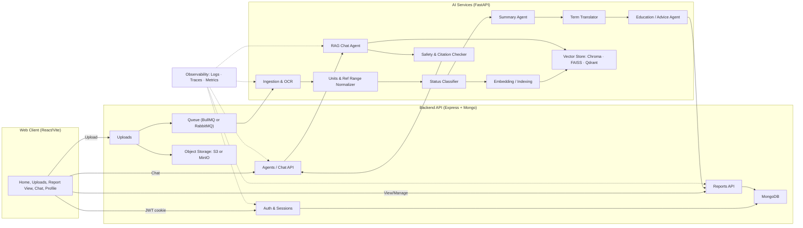
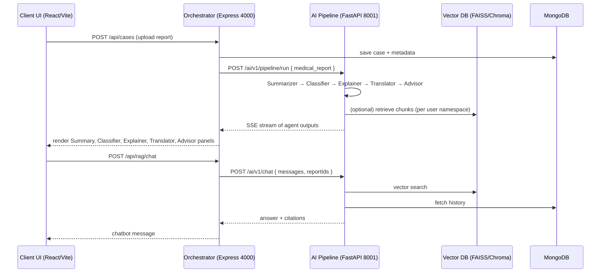
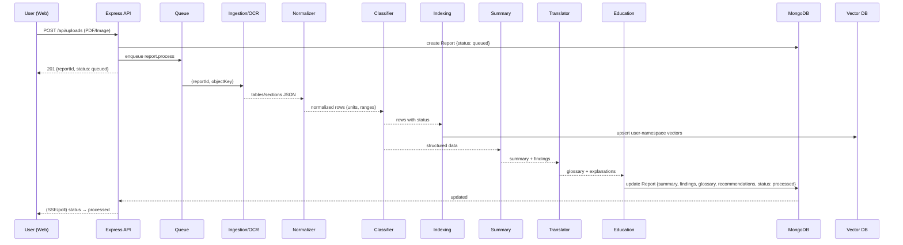
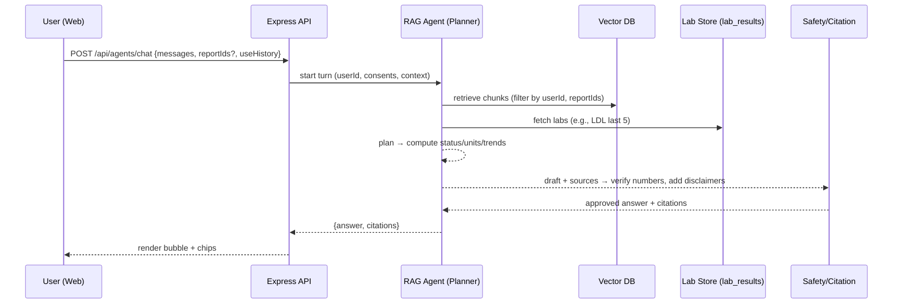
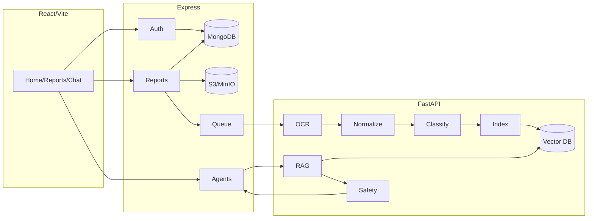
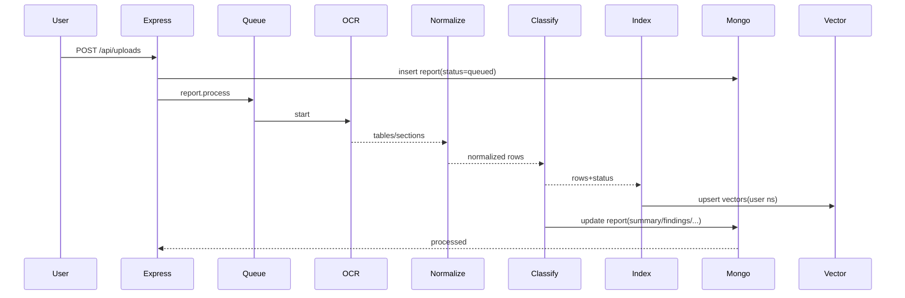
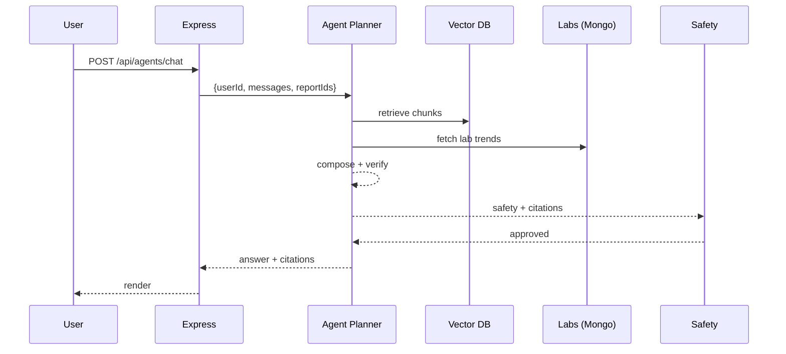

# Agent Collaboration & System Flow — MedScribe Agent

This report describes how our **agentic RAG** system will work end‑to‑end using **React** (frontend), **Express** (backend), and **Python FastAPI** (AI services). It includes architecture diagrams (Mermaid), each agent’s responsibilities and workflows, recommended LLMs/tools, API contracts, development workflow, and privacy/safety notes.

> **Scope note:** Educational support only — not a medical diagnosis. The system grounds answers in the user’s own documents and general medical knowledge while avoiding treatment guidance.

---

## 1) Executive summary
- Build a **web platform** that lets patients upload reports, get **plain‑language translations**, **structured summaries**, and **agentic chat** grounded in their history.
- Use a **hybrid memory** per user: (A) raw artifacts, (B) **structured facts** (timeseries labs + sections), (C) **embeddings** (per‑user namespace) for retrieval.
- Implement an **agentic controller** that plans, selects tools (retriever, unit converter, range lookup, status classifier, safety checker), verifies citations, and responds.

---

## 2) High‑level architecture



**Key principles**
- **Per‑user isolation** at DB and vector levels; every call is filtered by `userId`.
- **Async processing** pipeline for uploads; sync chat endpoints with quick SLAs.
- **Grounded outputs** with explicit **citations** back to report/page/test.

## Agent Communication Protocol (HTTP + JSON)
**Why**: auditable, provider‑agnostic, PHI‑safe, testable with Postman. (Future: optional MCP as internal tool bus.)

**Transport and versioning**
- HTTP/1.1, `Content-Type: application/json; charset=utf-8`
- Path versioning: `/ai/v1/*`; header `X-API-Version: 1`
- Timeouts: OCR 60s; retrieval or verify 15s; chat 30s (optionally streaming later)
- Retries: only idempotent ops (max 2 on 502 or 503 or 504)

**Security and privacy**
- Service auth: `Authorization: Bearer <service-jwt>` (rotated). User JWT never leaves backend.
- Headers: `X-Request-ID`, `traceparent`, `X-User-Id`, `X-Consent-History`, `X-Consent-Compare`
- Network: private VPC; option for mTLS; PII minimal (use ids, not NIC or phone)

**Response envelope**
```json
{ "ok": true, "data": { }, "requestId": "..." }
```
**Errors** use a canonical set: `BAD_REQUEST`, `UNAUTHORIZED`, `FORBIDDEN`, `NOT_FOUND`, `RATE_LIMITED`, `CONFLICT`, `UPSTREAM_TIMEOUT`, `UPSTREAM_ERROR`, `VALIDATION_FAILED`, `INTERNAL`.

**Sequence (GitHub‑safe)**


**Endpoint contracts (concise)**
- `/ai/v1/ingest` → `{ userId, reportId, objectKey }` → `{ parsedKey, pages, tables }`
- `/ai/v1/normalize` → `{ userId, reportId, parsedKey, patient }` → `{ rows[] }`
- `/ai/v1/index` → `{ userId, reportId, sections[] }` → `{ chunks, namespace }`
- `/ai/v1/retrieve` → `{ userId, reportIds?, query, k, filters? }` → `{ results[] }`
- `/ai/v1/chat` → `{ userId, reportIds?, messages[], mode, useHistory }` → `{ answer, citations[], trend? }`
- `/ai/v1/verify` → `{ userId, draft, sources[] }` → `{ verified, disclaimer, redFlags[] }`
---

## 3) Memory model (final)
1) **Raw Artifacts**: original files + `parsed.json` (tables/sections); S3/MinIO path `reports/{userId}/{reportId}/...`.
2) **Structured Facts** (Mongo):
   - `lab_results(ownerId, reportId, panel, test, value, unitCanonical, refLow, refHigh, status, measuredAt, ageAtTest, sex)`
   - `report_sections(ownerId, reportId, section, page, text)`
3) **Embeddings** (Vector DB): per‑user **namespace** with chunk metadata `{userId, reportId, section, panel?, test?, page?, reportedAt}`.

Why hybrid? Documents alone are weak for **trends**; structured facts alone are weak for **explanations**. Together they enable precise **numeric reasoning** *and* rich **semantic grounding**.

---

## 4) Agents — responsibilities & I/O

| Agent | Purpose | Inputs | Tools/Data | Outputs |
|---|---|---|---|---|
| **Ingestion & OCR** | Extract text/tables from PDFs/images | `objectKey`, `reportId` | PyMuPDF/pdfminer, PaddleOCR/Tesseract | `parsed.json` (sections + tables) |
| **Units & Range Normalizer** | Canonicalize units; apply age/sex ranges | tables from parsed | `pint` (units), internal ref ranges | normalized rows |
| **Status Classifier** | Label Normal / Slightly Abnormal / Abnormal (tolerance band) | normalized rows | rules + thresholds | rows with `status` |
| **Embedding/Indexing** | Chunk sections, embed; per‑user namespace | report_sections | **bge-m3/e5-multilingual** + Chroma/FAISS/Qdrant | vectors + metadata |
| **Summary Agent** | Concise report summary & key findings | rows + sections | LLM (reasoning) | summary JSON (findings list) |
| **Term Translator** | Plain‑language glossary (Sinhala/English) | terms from rows/sections | LLM + terminology map | glossary entries |
| **Education/Advice** | Educational “what this means” + next steps | summary + rows | LLM + safety guardrails | explanations + neutral guidance |
| **RAG Chat Agent** | Conversational Q&A grounded in history | user query + context | Retriever (VDB), `lab_results`, reranker | answer + citations |
| **Safety & Citation Checker** | Verify numbers to sources; add disclaimers | draft answer + chunks | regex/AST matchers, LLM self‑check | approved answer or requery |

> **Note**: The three user‑facing agents (Translator, Summary, Advice) can be separate “modes” of one orchestrator. The background agents feed them.

---

## 5) End‑to‑end workflows

### 5.1 Upload → Insights (async pipeline)


### 5.2 Agentic RAG Chat (per turn)


---

## 6) Recommended models & tools

**Reasoning/orchestration LLM (tool use + self‑check)**
- **Cloud**: GPT‑4‑class model (strong function‑calling, reliable reasoning, multilingual). Cost tier: standard + a cheaper “mini” for rote tasks.
- **Open‑source fallback**: Llama‑3.1‑70B / Qwen‑2.5‑72B with a guardrail layer; consider hosted inference for latency.

**Embeddings (multilingual, Sinhala/English)**
- **`bge-m3`** (unified text/retrieval) or **`e5-multilingual-large`**. Smaller `base/small` variants for cost.

**Reranking (optional, boosts precision)**
- **Cohere Rerank v3**, **Jina‑reranker‑v2**, or **Voyage‑rerank** (if external). Local: **bge‑reranker‑base**.

**OCR & PDF parsing**
- **PyMuPDF**/**pdfminer.six** for text‑PDFs, **PaddleOCR**/**Tesseract** for images.

**Units & ranges**
- **`pint`** for unit conversion (mg/dL ↔ mmol/L). Maintain a vetted **reference‑range table** keyed by age/sex/test/unit.

**Vector DB**
- Start with **Chroma** or **FAISS** (local). Consider **Qdrant** managed for production.

**Queues & jobs**
- **BullMQ** (Redis) for Node workers, or **RabbitMQ** if you want language‑agnostic workers.

**Observability**
- Structured logs (pino/winston), **OpenTelemetry** traces, **Prometheus/Grafana** metrics, **Sentry** for errors.

**Security**
- JWT access (short) + refresh token; cookie flags in prod (`Secure`, `SameSite=None`).
- Signed URLs for object storage.
- Role/consent checks on every data access.

---

## 7) API contracts (concise, no code)

**Auth**
- `POST /api/auth/register` → user + cookie
- `POST /api/auth/login` → cookie
- `POST /api/auth/logout` → clear cookie
- `POST /api/auth/refresh` → rotate access

**Users/Profiles**
- `GET/PUT /api/users/me` → profile + consents

**Uploads/Reports**
- `POST /api/uploads` (multer or presign) → `{reportId}`
- `GET /api/reports` → list
- `GET /api/reports/:id` → summary, findings, glossary, recommendations, panels
- `DELETE /api/reports/:id` → purge (files + DB + vectors)

**History (structured memory)**
- `GET /api/history/overview` → latest key tests
- `GET /api/history/labs?test=LDL&limit=5` → timeseries rows

**Chat/Agents**
- `POST /api/agents/chat` → `{answer, citations, trend?}`

---

## 8) Frontend UX mapping (React)
- **/home**: avatar, quick actions (Profile, Chat, Upload), recent reports (status chips), assistants hub.
- **/uploads**: drag‑and‑drop, progress, last N uploads.
- **/reports/:id**: summary card, key findings table (Test | Result | Ref | Status), meaning, next steps, glossary; footer disclaimer.
- **/chat**: session list; mode switch (Translator/Summary/Advice/RAG), report picker, citation chips, “open section” preview.
- **/profile**: demographics, consents (allow historical use; allow cross‑report comparison).

---

## 9) Development workflow (industry)

**Branching & CI/CD**
- Trunk‑based with short‑lived feature branches.
- CI gates: lint (ESLint/Flake8), type checks (TS optional, Pydantic), unit tests, API smoke.
- PR template requires diagrams/README updates for interface changes.

**Environments**
- `dev` (local Docker Compose), `staging` (seed data), `prod`.
- Secrets via `.env` in dev; Vault/Secrets Manager in staging/prod.

**Testing**
- Unit tests for parsers, unit converters, status classifier.
- Contract tests for `/api/agents/chat` with canned vectors.
- E2E happy path: upload → processed → chat with citations.

**Quality & safety checks**
- Static prompts under version control.
- Red‑flag test vectors (critical lab values) must trigger safety messaging.
- Privacy tests: ensure `ownerId` scoping and purge flow delete everything.

**Delivery milestones**
1) **M1 Auth & Profile**: login/signup, `/profile`, consents.
2) **M2 Uploads & Pipeline**: status chips; processed summary (stubbed).
3) **M3 Memory & Retrieval**: lab_results + embeddings; `/history/*` endpoints.
4) **M4 Agentic Chat**: planner + tools + citations + safety.
5) **M5 Polish & Ops**: logs, metrics, refresh tokens, delete/purge.

---

## 10) Privacy, compliance & safety
- **Per‑user isolation** everywhere; vector **namespace = userId**.
- **Consent gates** for historical use and cross‑report comparison.
- **Deletion = purge** of files, rows, sections, and vectors (with audit log).
- **Educational only** banners; block diagnosis/treatment instructions.
- Store **reference ranges** internally; attribute general definitions but avoid practicing medicine.

---

## 11) Appendices — key diagrams (copy‑ready)

### A) Component/flow (copy to mermaid.live if needed)


### B) Upload pipeline (sequence)


### C) Agentic chat (sequence)


---

## 12) Final notes
- This design is **implementation‑ready** and scales from MVP (local Chroma/FAISS) to production (managed vector DB).
- Keep prompts, reference ranges, and safety rules in version control; treat them as code.
- Prioritize test fixtures with **realistic** lab rows and tricky edge cases (units, age/sex ranges, borderline values).

