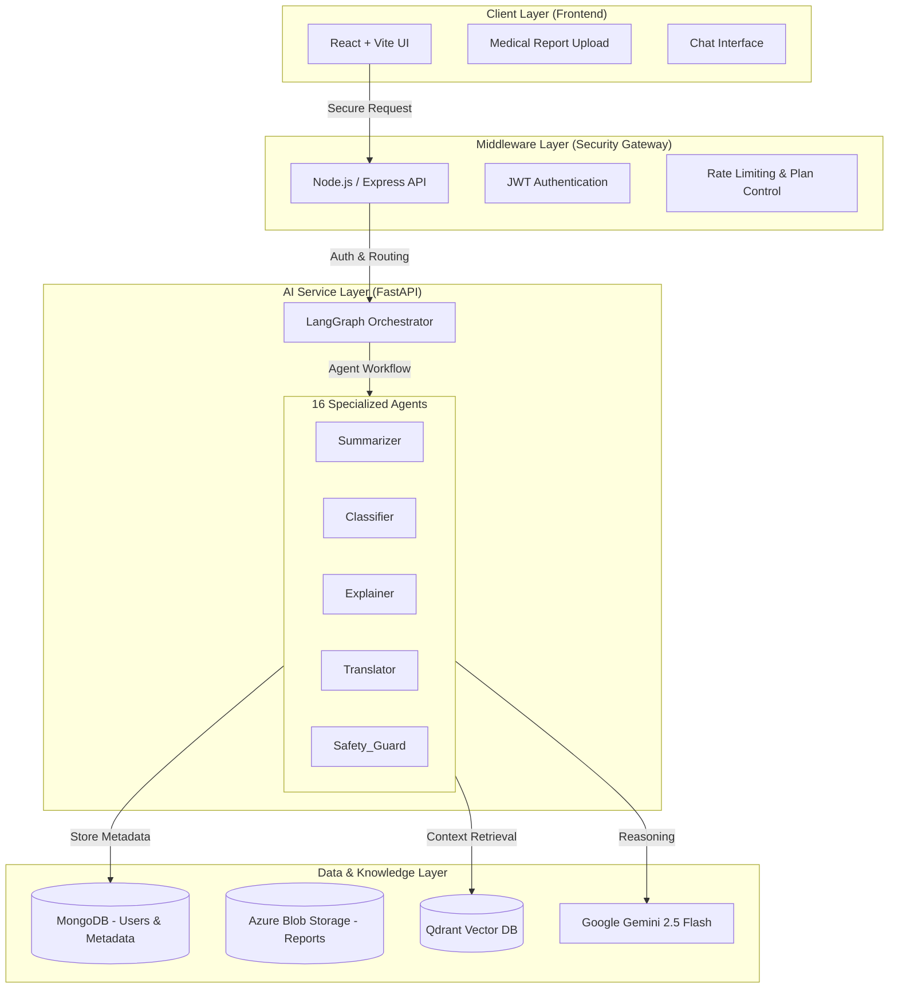

# 🩺 MedScribe Agent — Intelligent Medical Report Analyzer


**MedScribe** is a secure, agentic AI platform designed to interpret, summarize, and explain complex medical reports.  
It uses a **16-agent architecture** orchestrated by **LangGraph**, powered by **Google Gemini 2.5 Flash**, **Qdrant Vector DB**, and **Azure Blob Storage**.

The system delivers **plain-language medical explanations**, **bilingual output (English & Sinhala)**, and a **RAG-powered chatbot** grounded strictly in the user’s own medical reports.

> ⚠️ **Disclaimer**  
> This system is for educational and assistive purposes only.  
> It does **NOT** provide medical diagnoses, prescriptions, or treatment decisions.

---

## 🏗️ High-Level Architecture

MedScribe follows a **secure 5-tier architecture**.  
The frontend never communicates directly with LLMs — all AI access is routed through a protected middleware layer.



---

## 🚀 Key Features

- **16-Agent LangGraph Orchestration**
- **Bilingual Medical Explanation (English / Sinhala)**
- **RAG-based “Talk to Your Reports” Chatbot**
- **AES-256 Encryption & PII Redaction**
- **Emergency Safety Guardrails**

---

## 🤖 The 16-Agent System

### 🧾 Report Processing Chain (7 Agents)
1. Validator  
2. Classifier  
3. Summarizer  
4. Explainer  
5. Advisor  
6. Tone Checker  
7. Translator  

### 💬 Chatbot RAG Chain (9 Agents)
8. Safety Guard  
9. Intent Classifier  
10. Retriever  
11. Reasoning  
12. Chat Translator  
13. Chat Advice  
14. Chat Summarizer  
15. Faithfulness Checker  
16. General Health  

---

## 🛠️ Technology Stack

| Domain | Technologies |
|------|-------------|
| Frontend | React, Vite, Tailwind, ShadCN |
| Backend | Node.js, Express, JWT |
| AI | FastAPI, LangChain, LangGraph |
| LLM | Google Gemini 2.5 Flash |
| Vector DB | Qdrant |
| Storage | MongoDB, Azure Blob |
| Security | AES-256, PII Redaction |

---

## ⚡ Setup & Installation

```bash
git clone https://github.com/kavindugit/medscribe-Agent.git
cd medscribe-Agent
docker-compose up --build
```

---

## 📄 License

MIT License
