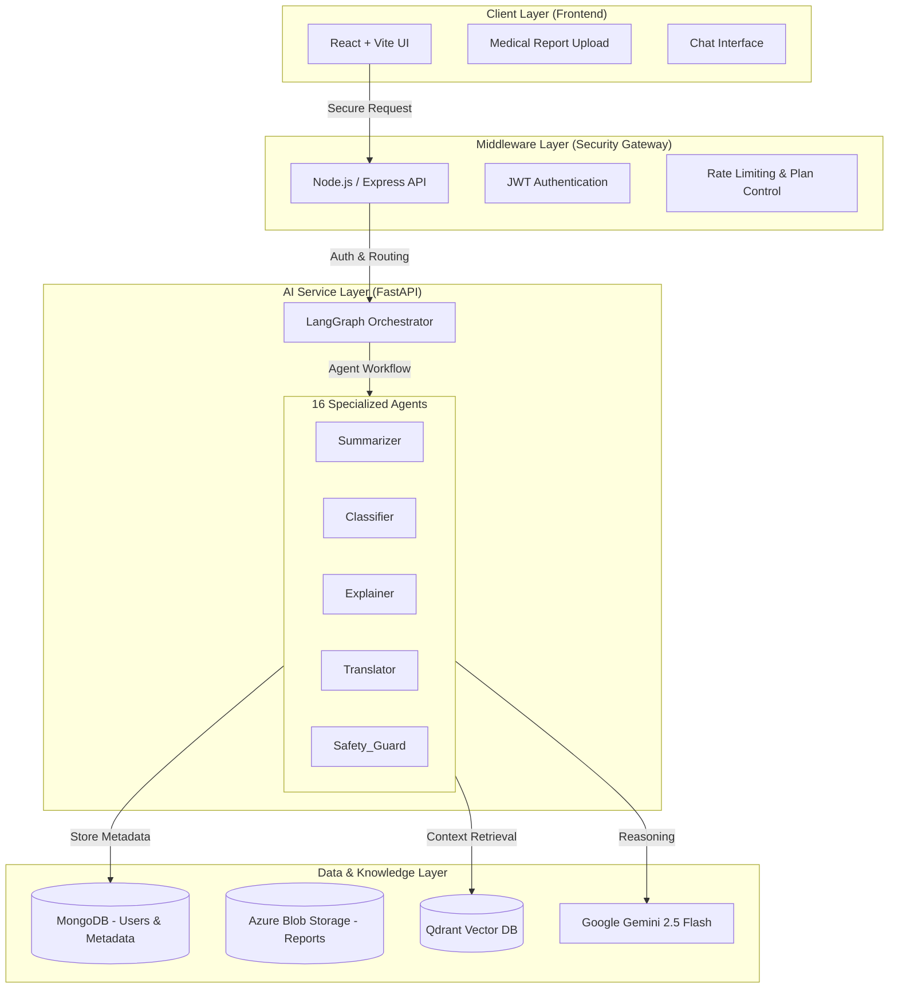

# 🩺 MedScribe Agent — Intelligent Medical Report Analyzer


**MedScribe** is a secure, agentic AI platform designed to interpret, summarize, and explain complex medical reports.  
It uses a **16-agent architecture** orchestrated by **LangGraph**, powered by **Google Gemini 2.5 Flash**, **Qdrant Vector DB**, and **Azure Blob Storage**.

The system delivers **plain-language medical explanations**, **bilingual output (English & Sinhala)**, and a **RAG-powered chatbot** grounded strictly in the user’s own medical reports.

> ⚠️ **Disclaimer**  
> This system is for educational and assistive purposes only.  
> It does **NOT** provide medical diagnoses, prescriptions, or treatment decisions.

---

## 🏗️ High-Level Architecture

MedScribe follows a **secure 5-tier architecture**.  
The frontend never communicates directly with LLMs — all AI access is routed through a protected middleware layer.



---

## 🚀 Key Features

* **16-Agent LangGraph Orchestration:** Decomposes complex analysis into specific tasks using specialized agents managed by **LangGraph**.
* **Bilingual Medical Explanation (English / Sinhala):** Automatically translates summaries, glossaries, and health advice between **English** and **Sinhala**.
* **RAG-based “Talk to Your Reports” Chatbot:** Uses **Qdrant** vector search to answer follow-up questions grounded strictly in the user's specific report history.
* **Emergency Safety Guardrails:** Dedicated **Safety Guard** agents detect emergencies (e.g., chest pain) and halt processing to advise urgent care.

---

## 🤖 The 16-Agent System

### 🧾 Report Processing Chain (7 Agents)
1. Validator  
2. Classifier  
3. Summarizer  
4. Explainer  
5. Advisor  
6. Tone Checker  
7. Translator  

### 💬 Chatbot RAG Chain (9 Agents)
8. Safety Guard  
9. Intent Classifier  
10. Retriever  
11. Reasoning  
12. Chat Translator  
13. Chat Advice  
14. Chat Summarizer  
15. Faithfulness Checker  
16. General Health  

---

## 🛠️ Technology Stack

| Domain | Technologies |
|------|-------------|
| Frontend | React, Vite, Tailwind, ShadCN |
| Backend | Node.js, Express, JWT |
| AI | FastAPI, LangChain, LangGraph |
| LLM | Google Gemini 2.5 Flash |
| Vector DB | Qdrant |
| Storage | MongoDB, Azure Blob |

---

## 🌟 Usages & Practical Applications

MedScribe is designed to serve multiple stakeholders in the healthcare ecosystem by bridging the gap between raw medical data and human understanding.

### 1. For Patients: Empowerment & Clarity
* **Simplify Lab Reports:** Instantly converts complex medical terms (e.g., "High LDL", "Leukocytosis") into plain language explanations.
* **Bilingual Accessibility:** Translates medical summaries and health advice into **Sinhala**, making healthcare accessible to non-English speakers.
* **Personalized Health Tips:** Provides non-prescriptive lifestyle and dietary monitoring advice based on specific test results.
* **Safe Q&A:** Allows patients to ask follow-up questions about their own reports without the risk of hallucinations or unsafe medical advice.

### 2. For Clinicians: Rapid Triage
* **Time-Saving Summaries:** Generates concise summaries of lengthy reports, highlighting critical abnormalities and severity levels (Normal, At Risk, High Risk).
* **Structured Data:** Organizes unstructured OCR text into categorized health domains (e.g., Cardiac, Kidney, Diabetes) for quick review.

### 3. For Hospitals & Laboratories
* **Automated Explanations:** Reduces the workload on staff by automating the "post-report explanation" process for patients.
* **Digital Transformation:** Converts physical paper reports (PDF/Image) into searchable, digital health records using OCR and Vector Storage.

### 🚨 Emergency Safety Mechanism
* **Critical Triage:** The system includes a "Safety Guard" agent that detects emergency phrases (e.g., "chest pain", "difficulty breathing").
* **Immediate Action:** If an emergency is detected, the AI halts processing and immediately directs the user to seek urgent medical care.

## ⚡ Setup & Installation

```bash
git clone https://github.com/kavindugit/medscribe-Agent.git
cd medscribe-Agent
docker-compose up --build
```

---

## 📄 License

MIT License
