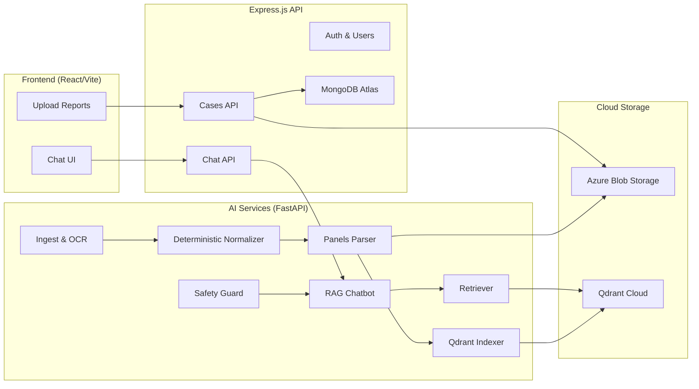
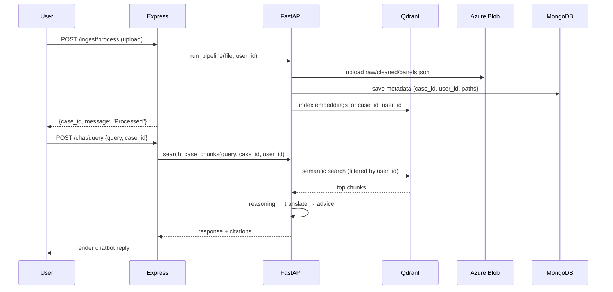

# 🧠 MedScribe — RAG Agentic Chatbot

Our **MedScribe Chatbot** is a medical-report–aware **Retrieval-Augmented Generation (RAG)** system.  
It allows patients to **chat with their uploaded medical reports**, retrieve structured data (labs, vitals, notes), and receive safe, plain-language explanations.  

⚠️ **Disclaimer:** Educational support only — not a medical diagnosis.

---

## 🚀 Features

- **Multi-Agent Architecture** — each agent performs a specialized task.
- **User Isolation** — every query and retrieval is scoped to a specific `user_id`.
- **Cloud-Native Storage**  
  - **MongoDB Atlas** → metadata (users, cases, reports).  
  - **Azure Blob Storage** → report files (raw, cleaned, panels).  
  - **Qdrant Cloud** → embeddings (per-user namespace).  
- **Agentic Orchestration** — pipeline ensures reports → clean text → structured panels → embeddings → retrieval → safe chatbot response.
- **Explainability** — citations and patient-friendly explanations are provided.
- **Multilingual Ready** — embeddings via `sentence-transformers/all-MiniLM-L6-v2`.

---

## 🏗️ System Architecture

---

## 🔧 Agents in the Chatbot

| Agent | Role |
|-------|------|
| **Safety Guard** | Detects emergencies (e.g. chest pain, difficulty breathing) and advises urgent care. |
| **Query Understanding** | Classifies intent (report question vs. general health). |
| **Report Retriever** | Retrieves chunks from Qdrant embeddings for the logged-in user’s reports. |
| **Knowledge Retriever** | Adds general medical knowledge when reports don’t cover the query. |
| **Reasoning Agent** | Summarizes retrieved chunks into a coherent draft. |
| **Translator Agent** | Converts jargon into patient-friendly language. |
| **Advice Agent** | Adds safe, general health advice (e.g. consult your doctor, lifestyle tips). |

---

## 🧩 Development Plan

1. **Phase 1 — Storage & Indexing**
   - Save reports in Azure Blob.  
   - Store metadata in MongoDB.  
   - Embed and index cleaned/panel data in Qdrant.  

2. **Phase 2 — Chatbot MVP**
   - Implement retriever (`search_case_chunks`).  
   - Add RAG pipeline with reasoning + translation + advice agents.  

3. **Phase 3 — Multi-Agent Orchestration**
   - Add summarizer and cross-report comparison.  
   - Implement safety guard + red-flag alerts.  

4. **Phase 4 — Production Hardening**
   - Short-lived signed URLs (Azure SAS).  
   - mTLS + JWT service-to-service security.  
   - Observability (logs, traces, metrics).  

---

## 📂 How Reports Are Used in Chat

- When a patient uploads a report:  
  1. **Raw file → OCR/Normalizer** → `cleaned.json`  
  2. **Panels Parser** → `panels.json`  
  3. Both are uploaded to **Azure Blob**  
  4. Metadata saved in **MongoDB** (`case_id`, `user_id`, paths)  
  5. Report sections + panels are embedded → stored in **Qdrant**  

- During chat:  
  - Query is embedded and searched in **Qdrant** with filter `{user_id}`.  
  - Relevant chunks are passed through reasoning → translator → advice agents.  
  - Response returned with **citations grounded in the patient’s reports**.

---

## ✅ Example Workflow

---

## ⚙️ Tech Stack

- **Frontend**: React + Vite + Tailwind  
- **Backend**: Express.js  
- **AI Services**: FastAPI (Python)  
- **Database**: MongoDB Atlas  
- **Object Storage**: Azure Blob Storage  
- **Vector DB**: Qdrant Cloud  
- **Embeddings**: `sentence-transformers/all-MiniLM-L6-v2`  
- **LLMs**: Gemini 1.5 Flash (fallback supported)  

---

## 🔒 Privacy & Safety

- **User isolation**: all queries filtered by `user_id`.  
- **Short-lived SAS URLs** for file access.  
- **Educational disclaimer** always included.  
- **Emergency guardrails**: urgent symptoms trigger “seek immediate care” alerts.  
